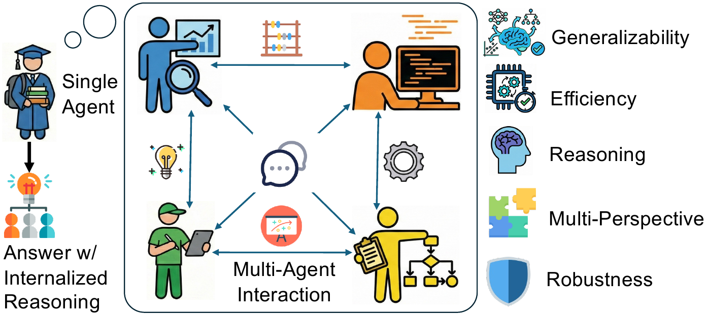
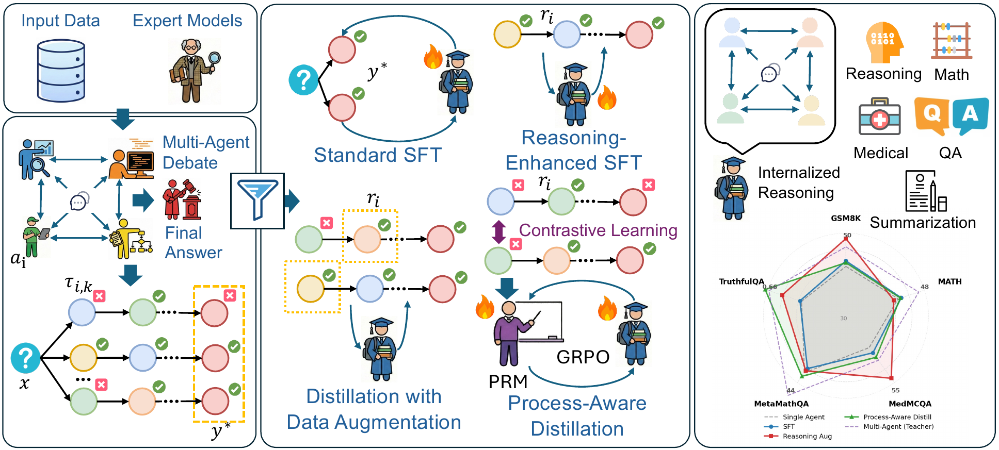

<h1 align="center">🛸 AgentArk</h1>

<p align="center"><em>Distilling Multi-Agent Intelligence into a Single LLM Agent.</em></p>

<p align="center">
  <a href="https://arxiv.org/abs/2602.03955"></a>
  <a href="https://github.com/AIFrontierLab/AgentArk"></a>
  
  
  
  
  <a href="LICENSE"></a>
</p>

<p align="center">
  
</p>

<p align="center">
  <a href="https://www.linkedin.com/in/yinyi-luo-5b0805324">Yinyi Luo</a><sup>1</sup> &middot;
  <a href="https://ahren09.github.io/">Yiqiao Jin</a><sup>2</sup> &middot;
  <a href="https://weichen-yu.github.io/">Weichen Yu</a><sup>1</sup> &middot;
  <a href="https://scholar.google.com/citations?user=h7HjebkAAAAJ">Mengqi Zhang</a><sup>3</sup> &middot;
  <a href="https://faculty.cc.gatech.edu/~srijan/">Srijan Kumar</a><sup>2</sup> &middot;
  <a href="https://xxlya.github.io/">Xiaoxiao Li</a><sup>5</sup> &middot;
  <a href="https://www.linkedin.com/in/weijie-xu-936b23101/">Weijie Xu</a><sup>4</sup> &middot;
  <a href="https://scholar.google.com/citations?user=dnkinp8AAAAJ">Xin Chen</a><sup>4</sup>;
  <a href="https://jd92.wang/">Jindong Wang</a><sup>3</sup>
</p>

<p align="center">
  <sup>1</sup>Carnegie Mellon University &nbsp;
  <sup>2</sup>Georgia Institute of Technology &nbsp;
  <sup>3</sup>William &amp; Mary &nbsp;
  <sup>4</sup>Amazon &nbsp;
  <sup>5</sup>University of British Columbia
</p>

---

## At a glance

| Metric | Value |
| --- | --- |
| Avg. accuracy lift over single-agent baseline | **+4.8%** |
| Total experiments across Qwen3 / Gemma 3 / Llama 3 | **120** |
| Hierarchical distillation strategies | **3** &nbsp;(R-SFT · DA · PAD) |
| Distillation questions / reasoning trajectories | **~342K / ~2M** |

---

## Abstract

While large language model (LLM) multi-agent systems achieve superior reasoning performance through iterative debate, practical deployment is limited by their high computational cost and error propagation. This paper proposes **AgentArk**, a novel framework to distill multi-agent dynamics into the weights of a *single* model, effectively transforming explicit test-time interactions into implicit model capabilities. This equips a single agent with the intelligence of multi-agent systems while remaining computationally efficient. Specifically, we investigate three hierarchical distillation strategies across various models, tasks, scaling, and scenarios: reasoning-enhanced fine-tuning; trajectory-based augmentation; and process-aware distillation. By shifting the burden of computation from inference to training, the distilled models preserve the efficiency of one agent while exhibiting strong reasoning and self-correction performance of multiple agents. They further demonstrate enhanced robustness and generalization across diverse reasoning tasks. We hope this work can shed light on future research on efficient and robust multi-agent development.

---

## Architecture

<p align="center">
  
</p>

AgentArk distills multi-agent debate into a single model through three hierarchical strategies — **Reasoning-Enhanced SFT (R-SFT)**, **Reasoning Trajectory-based Data Augmentation (DA)**, and **Process-Aware Distillation (PAD)** — moving the cost of collective reasoning from inference time into training time.

---

<details>
<summary><b>Table of Contents</b></summary>

- [Highlights](#highlights)
- [Installation](#installation)
- [Quick Start](#quick-start)
- [Supported Methods](#supported-methods)
- [Supported Datasets](#supported-datasets)
- [Supported Models](#supported-models)
- [Usage](#usage)
  - [Inference](#inference)
  - [Solution Labeling](#solution-labeling)
  - [Process Reward Model Training](#process-reward-model-training)
  - [RL Finetuning with GRPO](#rl-finetuning-with-grpo)
  - [Evaluation](#evaluation)
- [Configuration](#configuration)
- [Citation](#citation)
- [Acknowledgments](#acknowledgments)
- [License](#license)

</details>

---

## Highlights

- **Single-agent efficiency, multi-agent reasoning.** A distilled student matches most of the gain of a full debate ensemble at a fraction of the inference cost.
- **PRM capacity matters more than student size.** A stronger process reward model lifts smaller students disproportionately; student capacity bounds the multi-agent gain.
- **Reasoning quality outweighs quantity.** Curated, higher-fidelity trajectories beat naive scale-up of distillation data.
- **Process-aware distillation improves reasoning behavior, not just accuracy.** Students internalize critique-and-revise dynamics rather than memorizing answers.
- **Robust and general.** Gains transfer to out-of-distribution and robustness benchmarks (e.g., TruthfulQA).
- **Extends across modalities and model families.** Validated on Qwen3, Gemma 3, Llama 3, and Qwen2.5-VL (multimodal).

---

## Installation

### Requirements

| | |
| --- | --- |
| Python | 3.10+ |
| CUDA | 12.5 |
| GPU memory | 40 GB+ recommended for inference |

### Setup

```bash
# Clone the repository
git clone <repository-url>
cd AgentArk

# Create virtual environment
conda create -n agentark python=3.12
conda activate agentark

# Install dependencies
pip install -r requirements.txt

```

### Key Dependencies

| Category | Packages |
|----------|----------|
| LLM Inference | `transformers`, `vllm`, `flash-attn` |
| RL Training | `deepspeed`, `trl`, `torch` |
| Evaluation | `rouge_score`, `bert_score`, `sympy` |
| Utilities | `datasets`, `accelerate`, `peft`, `wandb` |

---

## Quick Start

```bash
# Run inference with LLM Debate on QMSum dataset
python inference.py \
    --method_name llm_debate \
    --test_dataset_name QMSum \
    --model_name Qwen/Qwen3-8B \
    --use_vllm \
    --tensor_parallel_size 2

# Evaluate results
python -m eval.short_answer_eval \
    --input_file results/QMSum/Qwen/Qwen3-8B/llm_debate_infer.jsonl \
    --dataset_name QMSum
```

---

## Supported Methods

Each method lives under [`methods/`](methods/) with its own YAML config in `methods/<name>/configs/`.

| Method | Directory | Description |
| --- | --- | --- |
| AgentVerse | [`methods/agentverse`](methods/agentverse) | Collaborative role-play with critic feedback rounds |
| AutoGen | [`methods/autogen`](methods/autogen) | Conversable multi-agent framework |
| CAMEL | [`methods/camel`](methods/camel) | Role-playing communicative agents |
| ChatDev | [`methods/chatdev`](methods/chatdev) | Software-development-oriented multi-agent pipeline |
| CoT | [`methods/cot`](methods/cot) | Single-agent chain-of-thought baseline |
| DyLAN | [`methods/dylan`](methods/dylan) | Dynamic agent network with listwise ranking |
| EvoMAC | [`methods/evomac`](methods/evomac) | Evolutionary multi-agent collaboration |
| LLM Debate | [`methods/llm_debate`](methods/llm_debate) | Iterative debate among peer agents |
| MacNet | [`methods/macnet`](methods/macnet) | Macro-network of communicating agents |
| MAD | [`methods/mad`](methods/mad) | Multi-Agent Debate |
| MapCoder | [`methods/mapcoder`](methods/mapcoder) | Code-generation pipeline with planner/coder roles |
| MAS Base | [`methods/mas_base`](methods/mas_base) | Shared base utilities for multi-agent systems |
| MAV | [`methods/mav`](methods/mav) | Multi-Agent Verifier |
| Self-Consistency | [`methods/self_consistency`](methods/self_consistency) | Parallel sampling with majority vote |

---

## Supported Datasets

| Dataset | Task type |
| --- | --- |
| MATH | Mathematical reasoning |
| GSM8K | Grade-school math |
| MetaMathQA | Augmented math |
| MedMCQA | Medical multiple choice |
| QASPER | Long-context scientific QA |
| HotpotQA | Multi-hop QA |
| QMSum | Query-based meeting summarization |
| TruthfulQA | Robustness / truthfulness |

---

## Supported Models

| Family | Models | Typical role |
| --- | --- | --- |
| Qwen 3 | Qwen3-32B, Qwen3-8B, Qwen3-1.7B, Qwen3-0.6B | Teacher (32B) / Students |
| Gemma 3 | Gemma3-27B-it, Gemma3-7B | Teacher / Student |
| Llama 3 | Llama3-8B-Instruct | Student |
| Qwen2.5-VL (multimodal) | Qwen2.5-VL-32B-Instruct, Qwen2.5-VL-3B | Teacher / Student |

---

## Usage

### Inference

Run multi-agent inference on a dataset:

```bash
python inference.py \
    --method_name <method> \
    --test_dataset_name <dataset> \
    --model_name <model_path_or_name> \
    --use_vllm \
    --tensor_parallel_size <num_gpus>
```

**Key Arguments:**

| Argument | Description | Default |
|----------|-------------|---------|
| `--method_name` | Multi-agent method to use | Required |
| `--test_dataset_name` | Dataset for evaluation | Required |
| `--model_name` | HuggingFace model or local path | Required |
| `--model_temperature` | Sampling temperature | 0.5 |
| `--model_max_tokens` | Maximum tokens per generation | 4096 |
| `--use_vllm` | Enable vLLM for efficient batching | False |
| `--tensor_parallel_size` | Number of GPUs for tensor parallelism | 1 |
| `--use_modal_batch` | Use Modal for cloud deployment | False |

<details>
<summary><b>Example — Running DyLAN on MATH</b></summary>

```bash
python inference.py \
    --method_name dylan \
    --test_dataset_name MATH \
    --model_name Qwen/Qwen3-32B \
    --use_vllm \
    --tensor_parallel_size 4 \
    --model_temperature 0.7
```

</details>

<details>
<summary><b>Example — Running with Modal Cloud</b></summary>

```bash
# First deploy the Modal model
modal deploy modal/launch_modal.py

# Then run inference
python inference.py \
    --method_name llm_debate \
    --test_dataset_name QMSum \
    --use_modal_batch \
    --model_name Qwen/Qwen3-8B
```

</details>

### Solution Labeling

Label generated solutions for correctness (required for PRM training):

```bash
python label.py \
    --input results/QMSum/Qwen/Qwen3-32B/llm_debate_infer.jsonl \
    --dataset_name QMSum \
    --model Qwen/Qwen2.5-72B-Instruct \
    --tensor_parallel_size 4
```

This produces labeled data with the format:

```json
{
    "query": "...",
    "gt": "ground truth answer",
    "solutions": [
        {"id": 1, "text": "solution text", "is_correct": true},
        {"id": 2, "text": "solution text", "is_correct": false}
    ],
    "labels": [true, false]
}
```

### Process Reward Model Training

Train a PRM to score intermediate reasoning steps:

<details>
<summary><b>Show training command</b></summary>

```bash
PYTHONPATH=$PYTHONPATH:$(pwd) python prm/finetune2.py \
    --model_name_or_path Qwen/Qwen3-8B \
    --train_data_path results/QMSum/labeled.jsonl \
    --output_dir outputs/prm_qmsum \
    --num_train_epochs 3 \
    --per_device_train_batch_size 64 \
    --per_device_eval_batch_size 16 \
    --gradient_accumulation_steps 1 \
    --learning_rate 1e-4 \
    --weight_decay 0.1 \
    --adam_beta2 0.95 \
    --warmup_ratio 0.0 \
    --logging_steps 1 \
    --save_strategy steps \
    --save_steps 500 \
    --save_total_limit 3 \
    --bf16 True \
    --gradient_checkpointing True \
    --fix_llm True \
    --enable_nan_monitoring True
```

</details>

### RL Finetuning with GRPO

Finetune the policy model using Group Relative Policy Optimization:

<details>
<summary><b>Show training command</b></summary>

```bash
python -m openrlhf.cli.train_grpo \
    --pretrain Qwen/Qwen3-0.6B \
    --reward_pretrain outputs/prm_qmsum \
    --save_path outputs/grpo_qmsum \
    --temperature 0.5 \
    --n_samples_per_prompt 8 \
    --advantage_estimator rloo \
    --reward_baseline token \
    --reward_mode PRMVR \
    --verifiable_reward_coef 1.0 \
    --micro_rollout_batch_size 4 \
    --rollout_batch_size 64 \
    --micro_train_batch_size 2 \
    --train_batch_size 128 \
    --actor_learning_rate 5e-7 \
    --init_kl_coef 0.001 \
    --max_epochs 1 \
    --num_episodes 1 \
    --prompt_max_len 40960 \
    --generate_max_len 2048 \
    --zero_stage 2 \
    --bf16 \
    --flash_attn \
    --gradient_checkpointing \
    --save_steps 20 \
    --logging_steps 1
```

</details>

**GRPO Key Arguments:**

| Argument | Description |
|----------|-------------|
| `--pretrain` | Base model to finetune |
| `--reward_pretrain` | Trained PRM checkpoint |
| `--n_samples_per_prompt` | Group size for RLOO baseline (keep >= 4) |
| `--advantage_estimator` | `rloo` or `gae` |
| `--reward_mode` | Reward computation mode (`PRMVR`, `ORM`, etc.) |
| `--micro_rollout_batch_size` | Prompts per GPU during rollout |
| `--micro_train_batch_size` | Samples per GPU during training |

**Memory Optimization Tips:**
- Lower `micro_rollout_batch_size` and `micro_train_batch_size` to save GPU memory
- Keep `n_samples_per_prompt >= 4` for stable GRPO performance
- Total samples = `rollout_batch_size` x `n_samples_per_prompt`

### Evaluation

#### Short-Answer Evaluation (ROUGE, BERTScore, F1)

```bash
python -m eval.short_answer_eval \
    --model_name_or_path Qwen/Qwen3-8B \
    --dataset_name QMSum \
    --split validation \
    --output_dir outputs \
    --temperature 0.7 \
    --use_vllm \
    --apply_chat_template
```

#### Batch Evaluation Across Models

```bash
for MODEL in Qwen/Qwen3-0.6B Qwen/Qwen3-1.7B Qwen/Qwen3-8B; do
    for DATASET in QMSum QASPER HotpotQA; do
        python -m eval.short_answer_eval \
            --model_name_or_path "$MODEL" \
            --dataset_name "$DATASET" \
            --split validation \
            --output_dir outputs \
            --use_vllm
    done
done
```

#### Math Evaluation (Exact Match)

```bash
python -m eval.math_eval \
    --input_file results/MATH/Qwen/Qwen3-8B/mav_infer.jsonl \
    --dataset_name MATH
```

---

## Configuration

Each method has YAML configuration files in `methods/<method_name>/configs/`.

### Example: DyLAN Configuration

```yaml
# methods/dylan/configs/config_main.yaml
random_seed: 0
num_agents: 4           # Number of agents in the network
num_rounds: 3           # Communication rounds
activation: "listwise"  # Agent ranking strategy
roles:
    - "Assistant"
    - "Assistant"
    - "Assistant"
    - "Assistant"
```

### Example: AgentVerse Configuration

```yaml
# methods/agentverse/configs/config_main.yaml
cnt_agents: 2               # Number of collaborative agents
max_turn: 3                 # Maximum conversation turns
max_criticizing_rounds: 3   # Critic feedback iterations
```

### Example: Self-Consistency Configuration

```yaml
# methods/self_consistency/configs/config_main.yaml
parallel_num: 5  # Number of parallel solution paths
```

### Example: LLM Debate Configuration

```yaml
# methods/llm_debate/configs/config_main.yaml
num_agents: 3           # Number of debating agents
num_rounds: 2           # Debate rounds
```

---

## Citation

If you find AgentArk useful for your research, please cite:

```bibtex
@article{luo2026agentark,
  title={AgentArk: Distilling Multi-Agent Intelligence into a Single LLM Agent},
  author={Luo, Yinyi and Jin, Yiqiao and Yu, Weichen and Zhang, Mengqi and Kumar, Srijan and Li, Xiaoxiao and Xu, Weijie and Chen, Xin and Wang, Jindong},
  journal={arXiv preprint arXiv:2602.03955},
  year={2026}
}
```

---

## Acknowledgments

AgentArk is built on top of excellent open-source work, including [OpenRLHF](https://github.com/OpenRLHF/OpenRLHF), [vLLM](https://github.com/vllm-project/vllm), [TRL](https://github.com/huggingface/trl), and HuggingFace [Transformers](https://github.com/huggingface/transformers).

---

## License

This project is released under the [Apache License 2.0](LICENSE).
